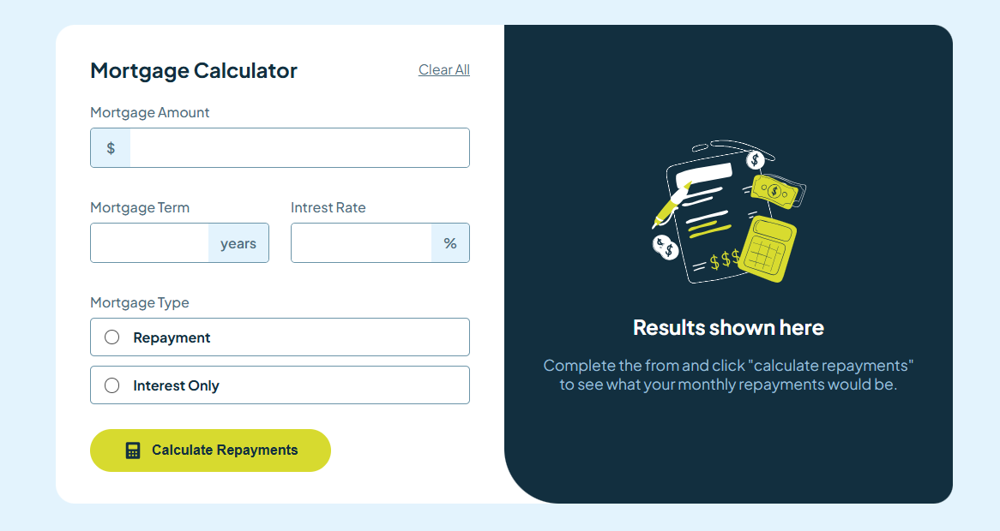
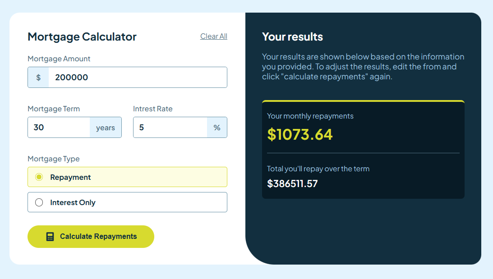

# Frontend Mentor - Mortgage repayment calculator solution
This project is a solution to the [Mortgage Repayment Calculator challenge from Frontend Mentor](https://www.frontendmentor.io/challenges/mortgage-repayment-calculator-Galx1LXK73). These challenges offer a hands-on way to build realistic projects and enhance your coding skills.

 

## Overview

### The challenge

Users should be able to:

- Enter mortgage details to see monthly and total repayments after submission.
- Get validation messages for missing required fields.
- Experience a responsive layout that adjusts to the device screen size.
- View hover and focus effects on interactive elements.

### Screenshots 

see the project [Live](https://mortgage-repayment-calculator-project.netlify.app/)

 

## Built with

- React
- Tailwind CSS
- mobile-first workflow

## Future Improvements

- [x] Use Tailwind CSS for styling.
- [ ] Migrate to TypeScript for type safety.

 

 

